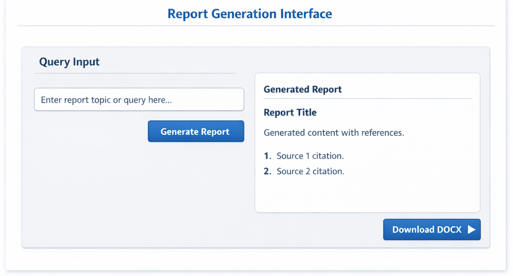

# 🧬 Triennial Report Generator  
### NIH-Style Chapter Automation with Deterministic Citation Control  
Databricks • Streamlit • LLM • Pandoc • NLM References

---

<p align="center">
  
</p>

> ⚠️ Replace the image paths above with actual screenshots from your app (recommended: create a `/docs/images` folder in your repo).

---

# 📌 Overview

The **Triennial Report Generator** is a production-grade Streamlit application deployed on **Databricks Apps** that transforms structured activity submissions into **publication-ready NIH-style DOCX chapters**.

This system is not a generic LLM wrapper. It enforces:

- Deterministic citation placement (sentence-level only)
- UID-anchored reference integrity
- NLM-style PMID formatting
- Style-guide constrained narrative generation
- Structured DOCX output using Pandoc and Word reference templates

The application is designed for regulatory-grade reporting where citation accuracy, formatting consistency, and reproducibility are critical.

---

# 🏗 System Architecture

<p align="center">
  
</p>

## Pipeline Flow

1. Excel master file ingestion  
2. Row-level filtering by Field / ICO  
3. LLM paragraph generation per activity  
4. Deterministic citation tagging (`[[CITE]] → [^UID]`)  
5. UID-to-numeric footnote mapping  
6. NLM reference formatting (PMID via PubMed API)  
7. Markdown assembly  
8. Pandoc conversion → Styled DOCX  

---

# 📂 Repository Structure

```
.
├── app.py
├── app.yaml
├── requirements.txt
├── style_prompt.json
├── reference.docx
├── h2_pagebreak.lua
├── h2_square_bracket_footnotes.lua
├── README.md
└── docs/
    └── images/
```

### Core Files

| File | Role |
|------|------|
| `app.py` | Main Streamlit application and orchestration engine |
| `style_prompt.json` | Governs NIH style constraints and narrative behavior |
| `reference.docx` | Word template for consistent formatting |
| `h2_pagebreak.lua` | Forces page break before 2nd-level headers |
| `h2_square_bracket_footnotes.lua` | Formats numeric square bracket citations |
| `app.yaml` | Databricks Apps runtime configuration |
| `requirements.txt` | Environment dependencies |

---

# 🧠 LLM Governance Model

This system does **not** allow free-form citation behavior.

### Deterministic Citation Enforcement

The LLM must append:

```
[[CITE]]
```

Only at the end of sentences directly supported by the source activity.

The app then:

- Strips hallucinated footnotes
- Converts tokens to `[^UID]`
- Maps UID to numeric sequence (`[^fn1]`, `[^fn2]`)
- Generates matching References section

This guarantees:

- No paragraph-end citation dumping
- No citation hallucination
- No duplicated UID numbering
- Stable reference ordering

---

# 📊 Data Requirements

Expected Excel Columns:

- Submitting ICO  
- Lead ICO  
- Unique ID  
- Activity Name  
- Activity Description  
- Field  
- Importance  
- Web address(es)  
- PMID(s)  
- Notes  

The **Unique ID (UID)** is the authoritative citation key.

---

# 📑 Output Structure

Generated DOCX contains:

1. Introduction (2–3 sentences, no citations)  
2. Summary (2–3 sentences, no citations)  
3. Thematic Sections (Field-aligned)  
4. Acronyms  
5. References (NLM formatted when PMID available)

All formatting controlled by `reference.docx`.

---

# 🛠 Deployment (Databricks Apps)

## 1️⃣ Repository Deployment

Upload repo to Databricks Workspace or connect GitHub.

## 2️⃣ Ensure `app.yaml` contains:

```yaml
command: ["streamlit", "run", "app.py"]
env:
  STREAMLIT_GATHER_USAGE_STATS: "false"
```

## 3️⃣ Required Environment Variables

| Variable | Purpose |
|----------|----------|
| TRIENNIAL_ENDPOINT | Databricks model serving endpoint |
| PANDOC_PATH (optional) | Explicit Pandoc binary path |
| TRIENNIAL_TEMPERATURE | LLM generation temperature |

---

# 🖥 Local Development

```
python -m venv .venv
source .venv/bin/activate
pip install -r requirements.txt
streamlit run app.py
```

Pandoc must be available via:

- `pypandoc-binary` (recommended)  
or  
- System-wide Pandoc installation  

---

# 🔐 Style & Compliance Constraints

Hard-enforced in code:

- No acronym expansion in narrative text  
- No raw UID tokens visible in prose  
- No inline URLs  
- No percent symbol (% → “percent”)  
- Sentence-level citation only  
- Deterministic cleanup of incomplete sentences  

---

# ⚠️ Known Operational Dependencies

- Internet access required for PubMed metadata fetch (PMID formatting)
- Pandoc required for DOCX conversion
- Databricks model serving endpoint required for paragraph generation

---

# 📈 Designed For

- NIH triennial reporting
- Regulatory chapter drafting
- Structured research activity synthesis
- Audit-ready citation workflows

---

# 📜 License

Specify project license here (MIT, Apache-2.0, Proprietary, etc.)

---

# 👤 Maintainer

Habtamu Wolde  
Senior Data & AI Systems Engineer  
Databricks • Azure • ML Systems • Research Automation

